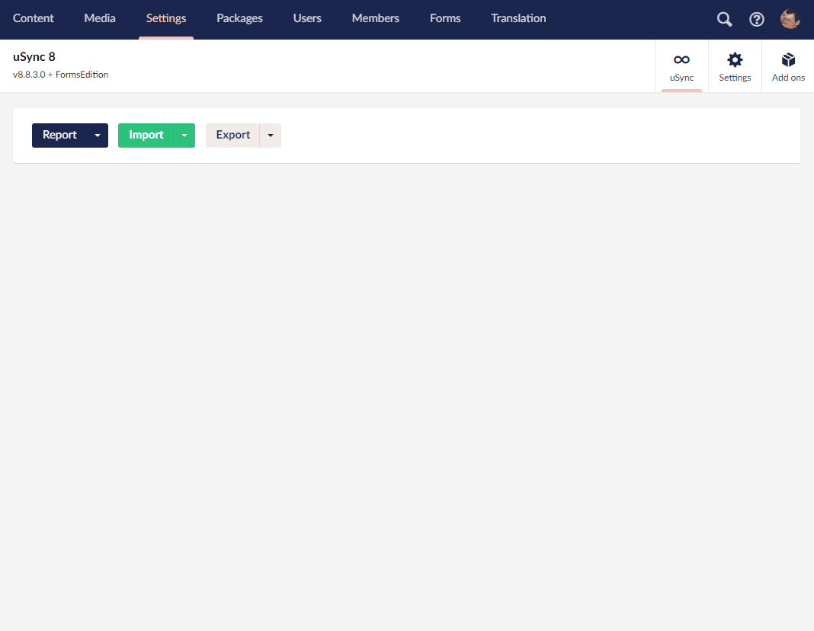

## uSync.FormsEdition (Umbraco v8)

Synchronize Umbraco forms between umbraco installations as part of uSync 8

### Requires uSync
uSync.FormsEdition is an add on to uSync v8 that provides handlers and serializers 
so you can sync forms, datasources and prevaluesources between servers. 

### Requires Umbraco.Forms
uSync.Forms Edition has been developed against Umbraco Forms v8.6.1 and should 
work with both onDisk and Database setups of Forms. 

---

