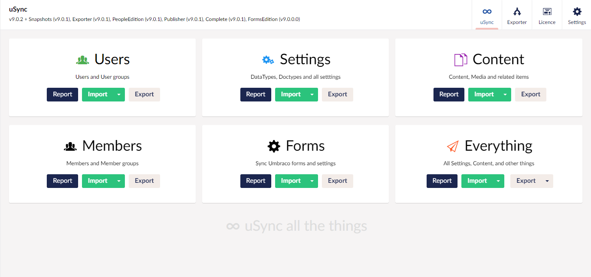

## uSync.FormsEdition (Umbraco v10)

Synchronize Umbraco forms between umbraco installations as part of uSync 9

```
dotnet add package uSync.Forms --version 10.0.0
```
https://www.nuget.org/packages/uSync.Forms


### Requires uSync
uSync.FormsEdition is an add on to uSync v8 that provides handlers and serializers 
so you can sync forms, datasources and prevaluesources between servers. 

### Requires Umbraco.Forms
uSync.Forms Edition has been developed against Umbraco Forms v10.


---


